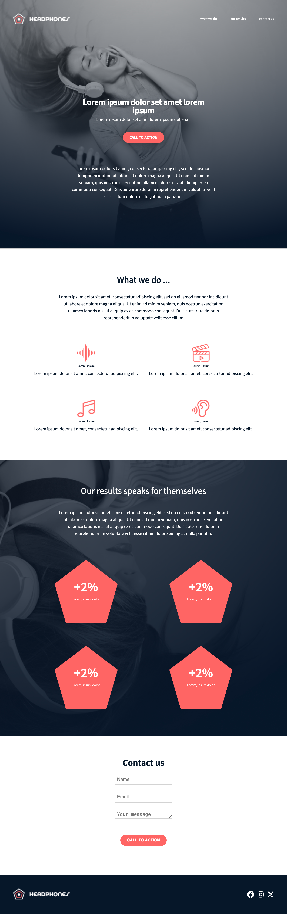

# Holberton School - Headphone company

## Table of contents

- [Header]
- [Hero]
- [What_we_do]
- [Results]
- [Contact]
- [Footer]

## Overview

Design:

- This is the landing homepage for the headphone company(Holberton School), shows the results, what we do and the contact section

### Screenshot

- Here is the complete design desktop screenshot



### Links

- Solution URL: [Add solution URL here](https://your-solution-url.com)
- Live Site URL: [Add live site URL here](https://your-live-site-url.com)

## My process

### Built with

- Semantic HTML5 markup
- CSS custom properties
- Flexbox
- CSS Grid
- Desktop-first workflow

### What I learned

Learned how to draw shaped using the clip-path

```css
.proud-of-this-css {
	clip-path: polygon(50% 0%, 100% 38%, 82% 100%, 18% 100%, 0% 38%);
}
```

### Continued development

- Need to learn how to draw more shapes using css

## Author

- Nicolas Philippot, UI/UX designer
